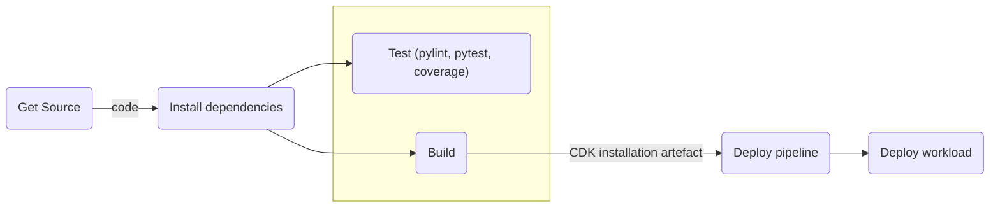

# Empty Python CDK Project with Auto-Updating Deployment CI/CD Pipelines

This is a blank project for Python development with AWS CDK, but with bells and whistles in the form of pipelines for testing and deployment to any number of environments. Linting, coverage and CI are controlled via test configuration files in the project.

Everything is set up for you to start coding, testing and deploying your application.

## Prerequisites

The pipelines assume your code is a Git repo stored on AWS CodeCommit. (You can easily modify the code for GitHub, GitLab, etc.)

## Installation

Clone this repo in any way you see fit, for instance, using SSH:

```
$ git clone git@gitlab.com:PeterBengtson/empty-python-cdk-project-with-cicd-pipelines.git
```

Next `cd` into it, create a virtual environment for it and activate it.

```
$ cd empty-python-cdk-project-with-cicd-pipelines
$ python3 -m venv .env
$ source .env/bin/activate
```

Install the CDK framework and its dependencies:

```
$ npm install
$ npm install -g aws-cdk
$ pip install -r requirements.txt
```

Edit the account, project, user, and repo information in `app.py`, the entry point of the application. Also edit the project info in `setup.py`. You may also want to take a look at `package.json` to edit the application name at the top, and the repo references at the very bottom.

Next, create the CDK artefacts:

```
$ cdk synth
```

Then bootstrap the region(s). This needs to be done only once:

```
$ cdk bootstrap
```

You may wish to use the `--profile=xxxxxx` switch, which is supported by all CDK commands.

When your region has been bootstrapped, you can check what will be created for the development pipeline:

```
$ cdk diff pipeline-dev
```

If all looks good, deploy it:

```
$ cdk deploy pipeline-dev
```

When this is done, your pipeline is active and monitoring your code changes in the `master` branch. It will build, test and deploy your changes from now on. You should follow the process in the AWS GUI, and you should also get an email whenever jobs complete, if you put your email address on the `sns_emails` list. If you did, don't forget to confirm the email subscription which will arrive as part of the deployment process. The job completion emails contain information about the job and its stages, and they also contain the results of your tests.

You can deploy the staging and production pipelines in the same manner, if and when you want.

## Coding

The entry point of the application is `app.py`. It references an example stack defined in `src/app_stack.py`, but you can of course arrange your code any way you wish. All code is under `src` to make it easy to import modules from the tests folder. The example stack is completely empty.

To run the linter:

```
$ pylint **/*.py
```

The linter is controlled through the `pylintrc` file. You can have multiple `pylintrc` copies on various levels of your application. The settings ignore the `.env` and `node_modules` directories.

To run the tests (of which there is exactly one):

```
$ pytest
```

Or run the tests through `coverage`to get an idea about test coverage:

```
$ coverage run -m pytest
$ coverage report
```

The linter, pytest and coverage will be invoked during the Test phase of the pipeline, in that order. You can control their overall behaviour in `buildspec.<env>.test.yml`. There must be one such file per environment. Global settings for the test tools can be found in `pylintrc`, `pytest.ini` and `.coveragerc`.

## Pipeline Structure

You might want to know a little about how the pipelines operate. The code follows a pattern meant to make it straightforward to change the pipeline and to add stages and actions.



I should point out that all actions - the boxes in the diagram above - are executed in isolated containers on separate CodePipeline EC2 instances. Thus, there is no risk of tests or other actions interfering with the contents of the final build in any way. This is another best CI/CI practice.

### Source

The first stage is the `Source` stage which fetches the code from CodeCommit when changes are detected. You can easily modify this stage to fetch code from elsewhere. It would be nice if CDK had a construct to abstract away the Git flavour entirely.

### Install

The second stage is the `Install` stage, which installs npm and Python libraries. It caches the npm and pip modules in S3 for speed and packages everything inside a self-contained output artefact, used by the rest of the stages. They never call outside for package installation. This is CI/CD best practice.

### Test & Build

The `TestAndBuild` stage consists of two things done in parallel: linting, coverage testing, and unit tests on one hand, and, on the other, the building of the CDK artefacts for deployment from what was previously installed. Both actions must succeed in order for the pipeline to progress to the next stage. If one of them fails, the pipeline run fails.

### Deploy Pipeline

First, this stage runs an update of the pipeline itself. If there were no changes, or there were but the changes didn't affect the structure of the pipeline, the action succeeds. However, if there were changes, these are now in effect and the action's outside world is _terra incognita_. Thus, it cancels the current run and starts a new one using the updated pipeline. The new run will pass right through this stage, and Bob is indeed your uncle. (Isn't this _delightfully_ meta? :sunglasses:)

### Deploy Workload

Finally, the stacks in the pipeline's list are deployed, in parallel. Since CDK is used for deployment, stack dependencies will be taken into account. This means that you should omit dependencies from the stack list: only list the top ones.

### Reporting

If the `sns_emails` list is non-empty, a detailed summary of the job will be sent to each confirmed subscriber. The report will contain timing, statistics and the results of the linter, the unit tests, and a test coverage report.

## Securing your Pipelines

To really secure your pipelines you should modify the pipeline deploy action privileges. By default, deployment runs with full privileges (`*:*`). You should reduce these to the minimum required for deployment to run. Look for the following statement in `pipeline_stack.py`:

```
iam.PolicyStatement(
    resources=['*'],   # This needs tightening up
    actions=['*'],     # This needs tightening up
)

```

There is one such statement in the pipeline deploy action, and one in the application deploy action. They would differ considerably when tightened up. (It's also possible to give the different pipeline actions individual privileges.)

However, you can start with the default full deployment privileges.
